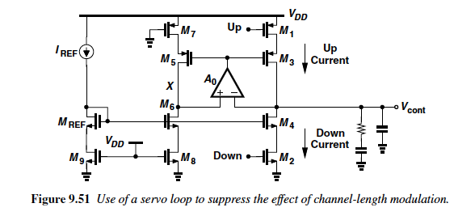

# PLL Generator Design

## Parameters

- Jitter
- Reference frequency
- Output frequency
- Tuning range?
- Locking time?

```rust
#[derive(Debug, Clone, Io)]
struct PllIo {
    pub fref: Input<Signal>,
    pub fout: Output<Signal>,
    pub pwr: PowerIo,
}

#[derive(Debug, Clone, Copy, Block)]
#[substrate(io = "PllIo")]
struct Pll {
    pub fref_min: Decimal,
    pub fref_max: Decimal,
    /// The frequency multiplication ratio.
    /// Must be a power of 2.
    pub multiplier: u32,
    pub jitter: Decimal,
    pub maxcap: Decimal,
}
```

## Specs

- Power
- Area

## Architecture

### VCO

RC loaded ring oscillator.
Capacitance implemented with MOSCAPs; resistance implemented with triode transistors.

```rust
#[derive(Debug, Clone, Io)]
struct VcoIo {
    pub tune: Input<Signal>,
    pub out: Output<Signal>,
    pub pwr: PowerIo,
}

#[derive(Debug, Clone, Copy, Block)]
#[substrate(io = "VcoIo")]
struct Vco {
    pub fmin: Decimal,
    pub fmax: Decimal,
    pub jitter: Decimal,
    pub maxcap: Decimal,
    pub rise_time: Decimal,
    pub fall_time: Decimal,
}
```

#### Specs
* VCO frequency operating range
* Jitter
* Max output capacitance


### Charge pump

Servo loop charge pump


```rust
#[derive(Debug, Clone, Io)]
struct ChargePumpIo {
    pub up: Input<Signal>,
    pub down: Input<Signal>,
    pub vcont: Output<Signal>,
    pub pwr: PowerIo,
}

#[derive(Debug, Clone, Copy, Block)]
#[substrate(io = "ChargePumpIo")]
struct ChargePump {
    pub i_pump: Decimal,
    pub r1: Decimal,
    pub c1: Decimal,
    pub c2: Decimal,
}
```

### DFF

Standard DFF with optimized CLK-Q and reset paths.

```rust
#[derive(Debug, Clone, Io)]
struct DffIo {
    pub clk: Input<Signal>,
    pub d: Input<Signal>,
    pub rst: Input<Signal>,
    pub q: Output<Signal>,
    pub pwr: PowerIo,
}

#[derive(Debug, Clone, Copy, Block)]
#[substrate(io = "DffIo")]
struct Dff {
    pub rst_to_q: Decimal,
    pub rst_rise: Decimal,
    pub rst_fall: Decimal,
    pub clk_to_q: Decimal,
    pub clk_rise: Decimal,
    pub clk_fall: Decimal,
    pub jitter: Decimal,
}
```

### PFD

Phase/frequency detector.

```rust
#[derive(Debug, Clone, Io)]
struct PfdIo {
    pub a: Input<Signal>,
    pub b: Input<Signal>,
    pub q_a: Output<Signal>,
    pub q_b: Output<Signal>,
    pub pwr: PowerIo,
}

#[derive(Debug, Clone, Copy, Block)]
#[substrate(io = "PfdIo")]
struct Pfd {
    pub a_rise: Decimal,
    pub a_fall: Decimal,
    pub b_rise: Decimal,
    pub b_fall: Decimal,
    pub max_frequency: Decimal,
}
```

### Divider

Tunable cascade of power of 2 dividers.

```rust
#[derive(Debug, Clone, Io)]
struct DividerIo {
    pub tune: Input<Array<Signal>>,
    pub clk_in: Input<Signal>,
    pub clk_out: Output<Signal>,
    pub pwr: PowerIo,
}

#[derive(Debug, Clone, Copy, Block)]
#[substrate(io = "DividerIo")]
struct Divider {
    pub fin: Decimal,
    pub clk_rise: Decimal,
    pub clk_fall: Decimal,
    /// The minimum divider ratio.
    /// Must be a power of 2.
    pub div_min: u32,
    /// The maximum divider ratio.
    /// Must be a power of 2.
    pub div_max: u32,
}
```